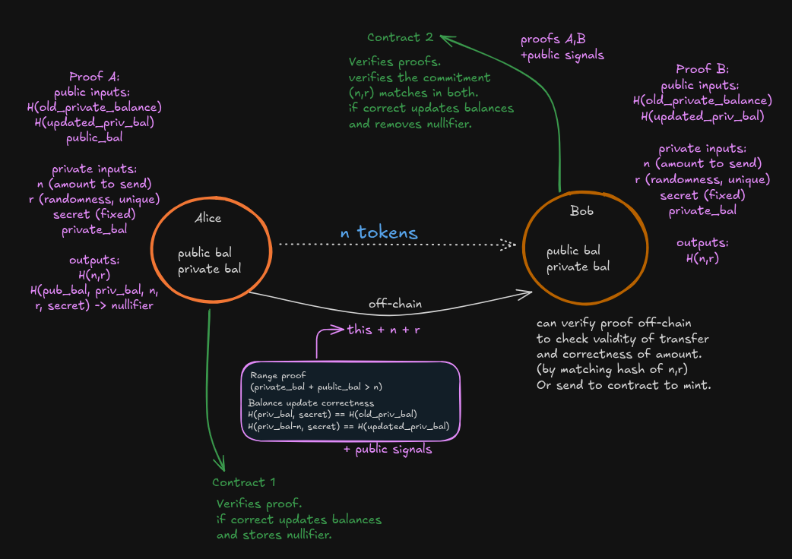

<<<<<<< HEAD
# EZIO
Private, **unlinkable** fund transfers powered by **zero-knowledge proofs**. 3zio enables confidential payments where the transferred amount and sender–receiver linkage remain hidden, while correctness and one‑time spend are enforced on-chain.

<p>
  <a href="./LICENSE"></a>
  
</p>

<div style="display:flex;flex-wrap:wrap;gap:8px;align-items:flex-start;justify-content:space-between">
  
  
</div>

## Why 3zio ?
- Built on a modified version of EIP‑7503 (zk wormhole) flow
- No sender/receiver linkage is preserved
- No linkability through IP or timings
- Transferred amount remains private
- Nullifier prevents double spends

## How it works
=======
# 3ZIO - Zero-Knowledge Cross-Chain Bridge# 3zio

 A privacy-preserving protocol for transferring funds. It enables atomic private transfers between users without revealing the transferred amount, while ensuring integrity and preventing double-spends.

**A privacy-preserving protocol for cross-chain asset transfers using zero-knowledge proofs.**

---

3ZIO enables atomic private transfers between blockchain networks without revealing transaction amounts, while ensuring integrity and preventing double-spends through zk-SNARK verification.

## Core Protocol

[](LICENSE)

[](https://soliditylang.org/)### short summary

[](https://docs.circom.io/)- `noteC` binds Alice’s private-balance deduction to the note Bob can claim

- `proof_A` proves Alice deducted `n` and posted `noteC` honestly

---- `proof_B` proves only recipient (holder of `pk_B`) can claim

- `nullifier` ensures one-time use of notes

## 🎯 Project Overview
>>>>>>> dev-circuit



<<<<<<< HEAD
At a glance:

- `noteC` binds Alice’s private balance deduction to the note Bob can later claim
- `proof_A` proves Alice honestly deducted `n` and posted `noteC`
- `proof_B` proves only the intended recipient (holder of `pk_B`) can claim
- A `nullifier` guarantees each note can be used only once, No double spend/transfer.

## Project layout

- `./ezio` – main frontend
- `./contract` – Solidity smart contracts (Hardhat v3)
- `./circuits` – Circom circuits for zk proofs
=======

3ZIO implements a complete zero-knowledge bridge system with:

- **Privacy-Preserving Transfers:** Users maintain public and private balances with cryptographic commitments### Phase 0: Preconditions

- **Dual-Circuit Verification:** Two complementary zk-SNARK circuits ensure proof integrity- Alice & Bob have accounts with:

- **Cross-Chain Compatibility:** Burn-and-mint architecture supports any EVM-compatible chains  - `publicBalance`

- **Double-Spend Prevention:** Nullifier-based system prevents proof reuse  - `PrivateCommitment`

- Bob has encryption key `pk_B`

### Key Features- Alice ensures `Pb[A] + Pr[A] ≥ n`


✅ **Private Balance Management** - Track private balances using Poseidon hash commitments  ### Phase 1: Alice Creates Note & Posts Commitment

✅ **ZK-SNARK Proofs** - Groth16 proofs verify state transitions without revealing amounts  

✅ **Dual Verification** - Circuit A + Circuit B provide complementary proof validation  **Alice (off-chain):**

✅ **Nullifier System** - Prevents double-spending and proof replay attacks  - Creates `note = (n, pk_B, salt)`

✅ **Sepolia Deployment** - Fully tested and operational on Sepolia testnet- Computes:

  - `noteC = Commit(n, pk_B, salt)`

---  - `C_A' = Commit(Pr_A - n, rA')`

  - Optional: `ct = Enc(pk_B, note || meta)`, `hct = Hash(ct)`

## 📁 Project Structure- Generates `proof_A` proving:

  - Correct commitments

```  - `noteC` is well-formed

3zio/  - Non-negative post-transfer balance

├── circuits/              # Zero-knowledge circuits (Circom)

│   ├── update_balance.circom    # Circuit A - Balance updates**Alice (on-chain):**

│   ├── proofB.circom           # Circuit B - Amount validation- Posts:

│   ├── *_js/                   # Compiled witness generators  - `proof_A`

│   └── *.ptau, *.zkey          # Trusted setup artifacts  - `oldCommit = C_A`

│  - `newCommit = C_A'`

├── contract/             # Smart contracts (Solidity)  - `noteCommit = noteC`

│   ├── contracts/  - `hct` (optional ciphertext pointer)

│   │   ├── main.sol           # Core balance management- Contract:

│   │   ├── Verifier.sol       # Circuit A verifier  - Verifies `proof_A`

│   │   ├── VerifierB.sol      # Circuit B verifier  - Updates Alice’s commitment

│   │   ├── burner_verfier.sol # Burn operations  - Records `noteC` in registry or emits a `NoteCreated` event

│   │   └── minter_verifier.sol # Mint operations

│   ├── scripts/              # Deployment & testing scripts

│   ├── deployments/          # Deployment documentation### Phase 2: Alice Sends Ciphertext to Bob (Off-Chain)

│   └── test/                 # Contract tests

│- Alice sends `ct` to Bob using a secure channel (e.g., wallet message, IPFS, Signal)

├── ezio/                 # Frontend (Next.js) - In Development- Bob decrypts to get `note` and verifies that `noteC = Commit(n, pk_B, salt)` matches the on-chain `noteC`

│

└── DEPLOYMENT_COMPLETE.md # Full deployment summary

```### Phase 3: Bob Claims the Note
>>>>>>> dev-circuit

## Quickstart
Below are the minimal steps to compile and check the Circom circuits. Frontend and contracts have their own standard workflows; see the respective folders for details.
### Circuits

<<<<<<< HEAD
Compile circuits:

```bash
cd circuits
make
```

Verify constraints/proofs (where applicable):

```bash
make verify
```

## Frontend (ezio)

The `ezio` app is the primary UI. Typical steps are: install deps, set env vars, and start the dev server.

**Nexus** handles user authentication and identity management, while **PayPal USD (PYUSD)** enables stable, on-chain payments verified through ZK proofs for secure, compliant transactions.
[For more info on how nexus and PayUSD are used](./ezio/README.md)

```bash
cd ezio
npm install -g pnpm
pnpm install
pnpm dev
```
you might need to run `pnpm approve-build` approve all of them

## Contracts
Contracts live in `./contract` (with additional work in `./contract_v2`). Use a modern Hardhat toolchain. See the folders for tasks such as build, test, and deploy.
```bash
cd contracts
npx hardhat ignition deploy ignition/modules/VerifierModule.ts
```

## Security properties
- Privacy: amount, sender, and receiver are not linkable on‑chain
- Integrity: proofs enforce correct balance updates
- Unlinkability: network‑level correlation reduced (no timing/IP linkage in protocol design)
- One‑time spend: nullifiers prevent note reuse

## Contributing
Issues and PRs are welcome. If you’re proposing a protocol change, please include a short rationale and any security considerations.

## License
MIT © 3zio contributors
=======

---**Bob (off-chain):**

- Decrypts `ct` to get `note`

## 🏗️ System Architecture- Builds `proof_B` proving:

  - Knowledge of `n`, `salt`, `sk_B`

```  - Correct opening of `noteC`

                    ┌─────────────────────────────┐  - Ownership of `pk_B`

                    │      Main_Contract          │  - Updated commitment `C_B' = Commit(Pr_B + n, rB')`

                    │  • Public/Private Balances  │  - Optional: outputs nullifier `N`

                    │  • Nullifier Tracking       │

                    │  • Controller Management    │**Bob (on-chain):**

                    └──────────┬──────────────────┘- Posts:

                               │  - `proof_B`

              ┌────────────────┴────────────────┐  - `noteCommit = noteC`

              │                                 │  - `oldCommit = C_B`

    ┌─────────▼──────────┐          ┌─────────▼──────────┐  - `newCommit = C_B'`

    │  Burner_Verifier   │          │  Minter_Verifier   │  - `nullifier = N`

    │  (Source Chain)    │          │ (Destination Chain)│- Contract:

    │                    │          │                    │  - Verifies `proof_B`

    │  • Circuit A proof │          │  • Circuit A proof │  - Ensures note was not claimed before (`!consumed`)

    │  • Burns balance   │          │  • Circuit B proof │  - Marks note as claimed

    │  • Records nullifier│         │  • Mints balance   │  - Updates Bob’s commitment

    └─────────┬──────────┘          └─────────┬──────────┘  - Stores used `nullifier`

              │                               │

    ┌─────────▼──────────┐          ┌─────────▼──────────┐## some failure modes

    │  Groth16Verifier   │          │  Groth16Verifier   │- what if bob didnt claim the proof, (use refundable bonds)

    │   (Circuit A)      │          │  Groth16VerifierB  │- bob should not be able to claim non existing proofs, created by himself

    │  5 public signals  │          │   (Circuit B)      │- linkability, reveals IP/timming whuch can compromise with timmings.

    └────────────────────┘          │  3 public signals  │

                                    └────────────────────┘
```

### Circuit Details

**Circuit A: `update_balance.circom`**
- **Purpose:** Proves correct balance state transitions
- **Public Signals (5):**
  1. `old_commitment` - Previous balance commitment
  2. `new_commitment` - New balance commitment
  3. `curr_pub_balance` - Current public balance
  4. `new_priv_balance` - New private balance
  5. `nullifier` - Unique proof identifier

**Circuit B: `proofB.circom`**
- **Purpose:** Validates transfer amounts between chains
- **Public Signals (3):**
  1. `old_commitment` - Previous commitment
  2. `new_commitment` - New commitment
  3. `amount_hash` - Poseidon hash of amount

---

## 🚀 Quick Start

### Prerequisites

- **Node.js** v18+ 
- **pnpm** v8+
- **Circom** 2.0.0+
- **snarkJS** CLI

### 1. Clone Repository

```bash
git clone https://github.com/IMPERIAL-X7/3zio.git
cd 3zio
```

### 2. Setup Circuits

```bash
cd circuits
npm install

# Compile circuits (already compiled in repo)
# circom update_balance.circom --r1cs --wasm --sym
# circom proofB.circom --r1cs --wasm --sym
```

See [`circuits/README.md`](circuits/README.md) for detailed circuit instructions.

### 3. Setup Contracts

```bash
cd contract
pnpm install

# Compile contracts
npx hardhat compile
```

See [`contract/README.md`](contract/README.md) for deployment instructions.

---

## 📡 Live Deployment (Sepolia Testnet)

### Contract Addresses

| Contract | Address |
|----------|---------|
| **Main_Contract** | `0xb21AD25eC6d65d92C998c76a22b3f5Dce2F9F7CB` |
| **Groth16Verifier** | `0x99923435d5774c962dC5c604Ee9970748E9FD0E2` |
| **Groth16VerifierB** | `0x777B6C1bB0608621f8d2AAd364890267A4488Ce1` |
| **Burner_Verifier** | `0x8Da48CfBCFC981c0f4342D8c3e22cd5A5cB41eCE` |
| **Minter_Verifier** | `0x78CAb97E087b7696eE31e0cdDCA25AcaA568C237` |

**Network:** Sepolia Testnet (Chain ID: 11155111)  
**RPC:** https://ethereum-sepolia-rpc.publicnode.com  
**Status:** ✅ Fully Operational

View full deployment details in [`DEPLOYMENT_COMPLETE.md`](DEPLOYMENT_COMPLETE.md).

---

## 🧪 Testing

All contracts have been tested on Sepolia:

```bash
cd contract

# Run Phase 1 & 2 tests
SEPOLIA_PRIVATE_KEY=<your-key> node scripts/test-simple.js

# Configure controllers (already done on deployment)
SEPOLIA_PRIVATE_KEY=<your-key> node scripts/setup-phase2.js
```

**Test Results:** ✅ All 6 tests passed
- Owner verification
- Balance queries  
- Controller configuration
- Contract reference validation

---

## 🔒 Security Features

1. **Nullifier System:** Each proof can only be used once, preventing double-spending
2. **Commitment Scheme:** Poseidon hash commitments hide balance amounts
3. **Dual Verification:** Two independent circuits validate different aspects of transfers
4. **Controller Pattern:** Restricted functions accessible only by authorized verifier contracts
5. **Amount Matching:** Circuit B's `amount_hash` must match between burn and mint operations

---

## 📖 Protocol Flow

### Burn Operation (Source Chain)

1. User generates proof using Circuit A with current balance state
2. `Burner_Verifier` validates proof via `Groth16Verifier`
3. If valid, calls `Main_Contract.burner()` to update balances
4. Nullifier recorded to prevent reuse

### Mint Operation (Destination Chain)

1. User generates proofs using both Circuit A and Circuit B
2. `Minter_Verifier` validates both proofs:
   - Circuit A proof via `Groth16Verifier`
   - Circuit B proof via `Groth16VerifierB`
3. Validates `amount_hash` matches between proofs
4. Checks nullifier hasn't been used
5. If all checks pass, calls `Main_Contract.minter()` to credit balance

---

## 🛠️ Development

### Contract Development

```bash
cd contract
pnpm install

# Compile
npx hardhat compile

# Test
npx hardhat test

# Deploy locally
npx hardhat node
npx hardhat ignition deploy ./ignition/modules/Main.ts --network localhost
```

### Circuit Development

```bash
cd circuits

# Compile circuit
circom <circuit_name>.circom --r1cs --wasm --sym

# Generate verifier
snarkjs zkey export solidityverifier <circuit>_0000.zkey ../contract/contracts/Verifier.sol
```

---

## 📚 Documentation

- **[Deployment Guide](DEPLOYMENT_COMPLETE.md)** - Complete deployment summary
- **[Contract README](contract/README.md)** - Smart contract documentation
- **[Circuit README](circuits/README.md)** - Zero-knowledge circuit guide
- **[Sepolia Deployment](contract/deployments/SEPOLIA_DEPLOYMENT.md)** - Live deployment details

---

## 🤝 Contributing

This is a demonstration project for educational purposes. For questions or issues:

1. Review the documentation in each subfolder
2. Check contract code in `contract/contracts/`
3. Examine circuit implementations in `circuits/`

---

## 📄 License

This project is licensed under the **GNU General Public License v3.0**.  
See [LICENSE](LICENSE) file for details.

---

## 🎓 Technical Stack

- **Smart Contracts:** Solidity 0.8.28
- **Zero-Knowledge:** Circom 2.0.0, snarkJS
- **Proof System:** Groth16 (via Powers of Tau ceremony)
- **Hash Function:** Poseidon (ZK-friendly)
- **Framework:** Hardhat 3.0.9
- **Network:** Ethereum (Sepolia Testnet)
- **Frontend:** Next.js 15 (In Development)

---

## 📊 Project Status

- ✅ **Circuits:** Compiled and tested
- ✅ **Contracts:** Deployed to Sepolia
- ✅ **Testing:** All integration tests passing
- ✅ **Documentation:** Complete
- 🚧 **Frontend:** In development

---

## 🔗 Links

- **Repository:** https://github.com/IMPERIAL-X7/3zio
- **Sepolia Etherscan:** [View Contracts](https://sepolia.etherscan.io/address/0xb21AD25eC6d65d92C998c76a22b3f5Dce2F9F7CB)
- **Circom Documentation:** https://docs.circom.io/
- **snarkJS:** https://github.com/iden3/snarkjs

---

**Built with ❤️ for privacy-preserving blockchain interoperability**
>>>>>>> dev-circuit
